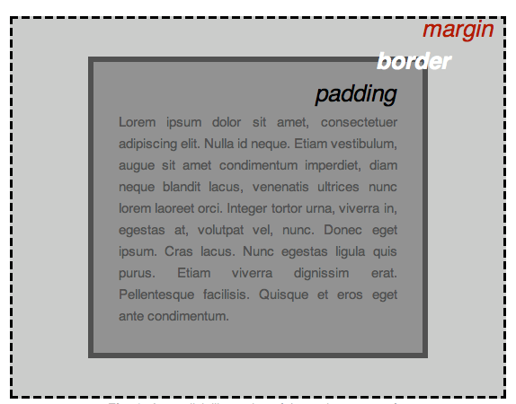

## CSS入门


### 1. CSS样式基础

#### 1. CSS基本概念

**CSS概念**：
- 层叠样式表(Cascading Style Sheets)
  - 层叠顺序
- 优先级(Specificity)
  - 相同优先级，顺序在最后的生效
- 继承


- 规则集
- **选择器**(Selector)
- **声明**(Declaration)
- **属性**(Properties)
- **属性值**(Property value)
- 除了选择器部分，每个规则集都应该包含在成对的大括号里（{}）。
- 在每个声明里要用冒号（:）将属性与属性值分隔开。
- 在每个规则集里要用分号（;）将各个声明分隔开。
- 选择多个元素
``` css
p,
li,
h1 {
  color: red;
}
```


#### 2. 选择器

- **选择器类型**
  - 元素选择器
  - ID选择器(id="")
  - 类选择器(class="")
  - 属性选择器(img[src])：	拥有特定属性的元素
  - 伪类选择器(a:hover)：特定状态下的特定元素（比如鼠标指针悬停在链接上时）


**CSS布局**
- 基于盒子模型
  - **padding**（内边距）：是指内容周围的空间。在下面的例子中，它是段落文本周围的空间。
  - **border**（边框）：是紧接着内边距的实线。
  - **margin**（外边距）：是围绕元素边框外侧的空间。
- 


**text-shadow**
- 第一个像素值设置阴影与文本的水平偏移量：阴影水平方向移动的距离（译者注：向右为正值）。
- 第二个像素值设置阴影与文本的垂直偏移量：阴影垂直方向移动的距离（译者注：向下为正值）。
- 第三个像素值设置阴影的模糊半径。值越大产生的阴影越模糊。
- 第四个值设置阴影的基色。


**根据元素在文档中的位置确定样式**
- 该选择器将选择<li>内部的任何<em>元素（<li>的后代）。因此在示例文档中，你应该发现第三个列表项内的<em>现在是紫色，但是在段落内的那个没发生变化。

``` css
li em {
  color: rebeccapurple;
}
```

它还可以包含了伪元素，选择一个元素的某个部分而不是元素自己。
``` css
p::first-line {
}
```

最后一组选择器可以将其他选择器组合起来，更复杂的选择元素。下面的示例用运算符（>）选择了\<article\>元素的初代子元素。
``` css
article > p {
}

```

**存否和值选择器**
| 选择器 | 示例 | 描述 |
| :---: | :---:| :---:|
| [attr] | a[title] |  匹配带有一个名为attr的属性的元素-方括号里的值|
| [attr=value] | a[href="https://example.com"] | 匹配带有一个名为attr的属性的元素，其值正为value——引号中的字符串。|
| [attr~=value]| p[class~="special"]|匹配带有一个名为attr的属性的元素，其值正为value，或者匹配带有一个attr属性的元素，其值有一个或者更多，**至少有一个和value匹配**。注意，在一列中的好几个值，是用空格隔开的。|
| [attr|=value] | div[lang|="zh"] | 匹配带有一个名为attr的属性的元素，其值可正为value，或者开始为value，后面紧随着一个连字符。|

省流：=表示类刚好等于value，~=还能匹配里面由一个空格隔开的含有value值的类，但是没有空格不算

**子字符串匹配选择器**

- li[class^="a"]匹配了任何值**开头**为a的属性，于是匹配了前两项。
- li[class$="a"]匹配了任何值**结尾**有a的属性，于是匹配了第一和第三项。
- li[class*="a"]匹配了**任何值的字符串中出现了a**的属性，于是匹配了所有项。


如果你想在大小写不敏感的情况下，匹配属性值的话，你可以在闭合括号之前，**使用i值**。这个标记告诉浏览器，要以大小写不敏感的方式匹配 ASCII 字符。没有了这个标记的话，值会按照文档语言对大小写的处理方式，进行匹配——HTML 中是大小写敏感的。

**几种关系选择器**

- **后代选择器**——典型用单个空格（" "）字符——组合两个选择器，
- **子代关系选择器**是个大于号（>），只会在选择器选中直接子元素的时候匹配。继承关系上更远的后代则不会匹配。
- **邻接兄弟选择器**（+）用来选中恰好处于另一个在继承关系上同级的元素**旁边**的物件。例如，选中所有**紧随**<p>元素之后的元素：
- 如果你想选中一个元素的兄弟元素，即使它们不直接相邻，你还是可以使用**通用兄弟关系选择器**（~）。要选中所有的<p>元素后任何地方的元素，我们会这样做：
``` css
p ~ img
```
#### 3. 伪类和伪元素


伪类就是**开头为冒号**的关键字。例如，:hover 就是一个伪类。

**简单伪类示例**
- :first-child
- :last-child
- :only-child
- :invalid


**用户行为伪类**

- :hover —— 上面提到过，只会在用户将**指针挪到元素上**的时候才会激活，一般就是链接元素。
- :focus —— 只会在用户**使用键盘控制，选定元素**的时候激活。


**伪元素**


::first-line伪元素选择器会值得信赖地做到这件事——即使单词/字符的数目改变，它也只会选中第一行。

``` css
article p::first-line {
  font-size: 120%;
  font-weight: bold;
}
```
- 加粗article里每个p的第一行

``` css
article p:first-child::first-line {
  font-size: 120%;
  font-weight: bold;
}

```
::before：插入文本在其他内容之前

``` css
.box::before {
  content: "这应该显示在其他内容之前。";
}
```
::after：插入文本在其他内容之后
``` css
.box::after {
  content: " ➥";
}
```

``` css
.box::before {
  content: "";
  display: block;
  width: 100px;
  height: 100px;
  background-color: rebeccapurple;
  border: 1px solid black;
}
```


#### 4.盒模型


**盒模型的各个部分**
CSS 中组成一个区块盒子需要：
- **内容盒子**：显示内容的区域；使用 inline-size 和 block-size 或 width 和 height 等属性确定其大小。
- **内边距盒子**：填充位于内容周围的空白处；使用 padding 和相关属性确定其大小。
- **边框盒子**：边框盒子包住内容和任何填充；使用 border 和相关属性确定其大小。
- **外边距盒子**：外边距是最外层，其包裹内容、内边距和边框，作为该盒子与其他元素之间的空白；使用 margin 和相关属性确定其大小。


``` css
.box {
  width: 350px;
  height: 150px;
  margin: 10px;
  padding: 25px;
  border: 5px solid black;
}
```
方框实际占用的空间宽为 410px（350 + 25 + 25 + 5 + 5），高为 210px（150 + 25 + 25 + 5 + 5）。


**代替盒模型**
在替代盒模型中，任何宽度都是页面上可见方框的宽度。内容区域的宽度是**该宽度减去填充和边框的宽度**（见下图）。**无需将边框和内边距相加**，即可获得盒子的实际大小。

``` css
.box {
  box-sizing: border-box;
}

.box {
  width: 350px;
  inline-size: 350px;
  height: 150px;
  block-size: 150px;
  margin: 10px;
  padding: 25px;
  border: 5px solid black;
}
```
现在，盒子实际占用的空间在行向为 350px，在块向为 150px


**display: inline-block** 是 display 的一个特殊值，它提供了介于 inline 和 block 之间的中间位置。如果**不希望项目换行，但又希望它使用 width 和 height 值并避免出现上述重叠现象**，请使用它。


#### 5. 层叠、优先级与继承


**控制继承**
CSS 为控制继承提供了五个特殊的通用属性值。每个 CSS 属性都接收这些值。
- **inherit**：设置该属性会使**子元素属性和父元素相同**。实际上，就是“开启继承”。
- **initial**：将应用于选定元素的属性值设置为**该属性的初始值**。
- **revert**：将应用于选定元素的属性值**重置为浏览器的默认样式**，而不是应用于该属性的默认值。在许多情况下，此值的作用类似于 unset。
- **revert-layer**：将应用于选定元素的属性值**重置为在上一个层叠层中建立的值**。
- **unset**：将属性重置为自然值，也就是如果属性是**自然继承**那么就是 **inherit**，否则和 initial 一样


层叠的三个因素
- **资源顺序**：后面的规则覆盖前面的规则，直到最后一个开始设置样式。
- **优先级**：不会覆盖所有规则，只覆盖相同的属性。这样可以避免重复的 CSS。一种常见的做法是给基本元素定义通用样式，然后给不同的元素创建对应的类。
- **重要程度**


一个选择器的优先级可以说是由三个不同的值（或分量）相加，可以认为是百（ID）十（类）个（元素）——三位数的三个位数：
- **ID**：选择器中包含 ID 选择器则百位得一分。
- **类**：选择器中包含类选择器、属性选择器或者伪类则十位得一分。
- **元素**：选择器中包含元素、伪元素选择器则个位得一分。

**通用选择器（*）、组合符（+、>、~、' '）和调整优先级的选择器（:where()）不会影响优先级。**

否定（:not()）和任意匹配（:is()）伪类本身对优先级没有影响，但它们的参数则会带来影响。参数中，对优先级算法有贡献的参数的优先级的最大值将作为该伪类选择器的优先级。


``` css
/* 1. 优先级：1-0-1 */
#outer a {
  background-color: red;
}

/* 2. 优先级：2-0-1 */
#outer #inner a {
  background-color: blue;
}

/* 3. 优先级：1-0-4 */
#outer div ul li a {
  color: yellow;
}

/* 4. 优先级：1-1-3 */
#outer div ul .nav a {
  color: white;
}

/* 5. 优先级：0-2-4 */
div div li:nth-child(2) a:hover {
  border: 10px solid black;
}

/* 6. 优先级：0-2-3 */
div li:nth-child(2) a:hover {
  border: 10px dashed black;
}

/* 7. 优先级：0-3-3 */
div div .nav:nth-child(2) a:hover {
  border: 10px double black;
}

a {
  display: inline-block;
  line-height: 40px;
  font-size: 20px;
  text-decoration: none;
  text-align: center;
  width: 200px;
  margin-bottom: 10px;
}

ul {
  padding: 0;
}

li {
  list-style-type: none;
}
```

``` html
<div class="container" id="outer">
  <div class="container" id="inner">
    <ul>
      <li class="nav"><a href="#">一</a></li>
      <li class="nav"><a href="#">二</a></li>
    </ul>
  </div>
</div>
```


**覆盖声明的顺序**
相互冲突的声明将按以下顺序应用，后一种声明将覆盖前一种声明：
- 用户代理样式表中的声明（例如，浏览器的默认样式，在没有设置其他样式时使用）。
- 用户样式表中的常规声明（由用户设置的自定义样式）。
- 作者样式表中的常规声明（这些是我们 web 开发人员设置的样式）。
- 作者样式表中的 !important 声明
- 用户样式表中的 !important 声明
- 用户代理样式表中的 !important 声明


**级联层的顺序**

在级联层中声明 CSS 时，优先级的顺序由**声明层的顺序**来决定。在任何层之外声明的 CSS 样式会被按声明的顺序组合在一起，形成一个未命名的层，它会被当作最后声明的层。对于存在冲突的常规（没有 !important 声明）样式，**后面的层比先前定义的层的优先级高**。但对于**带有 !important 标记的样式，其顺序相反**——先前的层中的 important 样式比后面的层以及为在层中声明的 important 样式优先级要高。但**内联样式比所有作者定义的样式的优先级都要高**，不受级联层规则的影响。

当你在不同的层中有多个样式块，且其中**提供了对于某一元素的单一属性的相互冲突的值**时，声明该冲突样式的层的顺序将决定其优先级。而不是高优先级的层直接覆盖低优先级的层中的所有样式。

#### 6. css值与单位

**绝对长度单位**
以下都是绝对长度单位——它们与其他任何东西都没有关系，通常被认为总是相同的大小。

|单位	|名称 |	等价换算|
| :---: | :---: | :---: |
|cm	|厘米	|1cm = 37.8px = 25.2/64in|
|mm	|毫米	|1mm = 1/10th of 1cm|
|Q	|四分之一毫米	|1Q = 1/40th of 1cm|
|in	|英寸	|1in = 2.54cm = 96px|
|pc	|派卡	|1pc = 1/6th of 1in|
|pt	|磅	|1pt = 1/72th of 1in|
|px	|像素	|1px = 1/96th of 1in|

**相对长度单位**
em 相对于本元素的字体大小，或者在用于 font-size 时相对于父元素的字体大小。rem 相对于根元素的字体大小。
vh 和 vw 分别相对于视口的高度和宽度。(百分比)


**概括地说，在排版属性中 em 单位的意思是“父元素的字体大小”**。带有 ems 类的 \<ul\> 内的 \<li\> 元素从它们的父元素中获取大小。因此，每一个连**续的嵌套级别都会逐渐变大**，因为每个嵌套的字体大小都被设置为 1.3em——是其父嵌套字体大小的 1.3 倍。

**概括地说，rem 单位的意思是“根元素的字体大小”。**（“根 em”的 rem 标准。）\<ul\> 内的 \<li\> 元素和一个 rems 类从根元素（\<html\>）中获取它们的大小。这意味着**每一个连续的嵌套层都不会不断变大**。


**数字**

有些值接受数字，不添加任何单位。接受无单位数字的属性的一个例子是不透明度属性（opacity），它控制元素的不透明度（它的透明程度）。此属性接受 0（完全透明）和 1（完全不透明）之间的数字。


**HSL 和 HSLA 的值**
另一种指定颜色的方法是 HSL 颜色模型。hsl() 函数不接受红、绿、蓝值，而是接受色相、饱和度和亮度值，这些值用于区分 1670 万种颜色，但方式不同：
- **色调**：颜色的底色。这个值在 0 和 360 之间，表示 color wheel 周围的角度。
- **饱和度**：颜色有多饱和？它的值为 0–100%，其中 0 为无颜色（它将显示为灰色阴影），100% 为全色饱和度
- **亮度**：颜色有多亮？它从 0–100% 中获取一个值，其中 0 表示没有光（它将完全显示为黑色），100% 表示完全亮（它将完全显示为白色）


#### 7. 调整大小


max-width 的常见用法为，在没有足够空间以原有宽度展示图像时，让图像缩小，同时确保它们不会比这一宽度大。

min-height 属性。盒子就会一直保持大于这个最小高度，但是如果有比这个盒子在最小高度状态下所能容纳的更多内容，那么盒子就会变大。


#### 8. 背景与边框

**background-color** 属性定义了 CSS 中任何元素的背景颜色。属性接受任何有效的 \<color\> 值。background-color 可以延伸至元素的内容和内边距盒子的下面。

默认情况下，大图不会缩小以适应盒子，因此我们只能看到它的一个小角，而小图则是平铺以填充方框。

**background-repeat** 属性用于控制图像的平铺行为。可用的值是：
- no-repeat——阻止背景重复平铺。
- repeat-x——仅水平方向上重复平铺。
- repeat-y——仅垂直方向上重复平铺。
- repeat——默认值，在水平和垂直两个方向重复平铺。

**background-position** 属性允许你选择背景图片出现在它所应用的盒子上的位置。这使用了一个坐标系统，其中方框的左上角是 (0,0)，方框沿水平（x）和垂直（y）轴定位。


指定内容滚动时的滚动方式。这是用 **background-attachment** 属性控制的，它可以取以下值：
- **scroll**：使元素的背景在页面滚动时滚动。如果滚动了元素内容，则背景不会移动。实际上，背景被固定在页面的相同位置，所以它会随着页面的滚动而滚动。
- **fixed**：使元素的背景固定在视口上，这样当页面或元素内容滚动时，它就不会滚动。它将始终保持在屏幕上相同的位置。
- **local**：将背景固定在它所设置的元素上，所以当你滚动该元素时，背景也随之滚动。


#### 9. 溢出的内容

如果你想在内容溢出的时候把它裁剪掉，你可以在你的盒子上设置 **overflow: hidden**。这就会像它表面上所显示的那样作用——隐藏掉溢出。这可能会很自然地让东西消失掉，所以你只应该在判断隐藏内容不会引起问题的时候这样做。

也许你还会想在有内容溢出的时候加个滚动条？如果你用了 **overflow: scroll**，那么你的浏览器总会显示滚动条，即使没有足够多引起溢出的内容。你可能会需要这样的样式，它避免了滚动条在内容变化的时候出现和消失。

我们仅仅需要在 y 轴方向上滚动，但是我们在两个方向上都有了滚动条。你可以使用 **overflow-y**属性，设置 overflow-y: scroll 来仅在 y 轴方向滚动。


### 2. CSS文本样式


#### 1. 基本文本和字体样式


**字体栈**
- 由于你无法保证你想在你的网页上使用的字体的可用性 (甚至一个网络字体可能由于某些原因而出错), 你可以提供一个字体栈 (font stack)，这样的话，浏览器就有多种字体可以选择了。只需包含一个 font-family 属性，其值由几个用**逗号**分离的字体名称组成。


``` css
text-shadow: 4px 4px 5px red;
```
4 个属性如下：
- **阴影与原始文本的水平偏移**，可以使用大多数的 CSS 单位 length and size units, 但是 px 是比较合适的。这个值必须指定。
- **阴影与原始文本的垂直偏移**;效果基本上就像水平偏移，除了它向上/向下移动阴影，而不是左/右。这个值必须指定。
- **模糊半径** - 更高的值意味着阴影分散得更广泛。如果不包含此值，则默认为 0，这意味着没有模糊。可以使用大多数的 CSS 单位 length and size units.
- **阴影的基础颜色**，可以使用大多数的 CSS 颜色单位 CSS color unit. 如果没有指定，默认为 black.


**文本对齐**
**text-align** 属性用来控制文本如何和它所在的内容盒子对齐。可用值如下，并且在与常规文字处理器应用程序中的工作方式几乎相同：
- **left**: 左对齐文本。
- **right**: 右对齐文本。
- **center**: 居中文字
- **justify**: 使文本展开，改变单词之间的差距，使所有文本行的宽度相同。你需要仔细使用，它可以看起来很可怕。特别是当应用于其中有很多长单词的段落时。如果你要使用这个，你也应该考虑一起使用别的东西，比如 hyphens，打破一些更长的词语。


**行高**
**line-height** 属性设置文本每行之间的高，可以接受大多数单位 **length and size units**，不过也可以设置一个无单位的值，作为乘数，通常这种是比较好的做法。无单位的值乘以 font-size 来获得 line-height。


**字母和单词间距**
**letter-spacing** 和 **word-spacing** 属性允许你设置你的文本中的字母与字母之间的间距、或是单词与单词之间的间距。


#### 2. 为列表添加样式


**符号样式**
像上面所提及的，list-style-type 属性允许你设置项目符号的类型，在我们的示例中，我们在有序列表上设置了大写罗马数字：
``` css
ol {
  list-style-type: upper-roman;
}
```

--------------------------------

**项目符号位置**
**list-style-position**设置在每个项目开始之前，项目符号是出现在列表项内，还是出现在其外。如上所示，默认值为 outside，这使项目符号位于列表项之外。

------------------------------------

**使用自定义的项目符号图片**
**list-style-image** 属性允许对于项目符号使用自定义图片。其语法相当简单：
``` css
ul {
  list-style-image: url(star.svg);
}
```

示例：
``` css
ul {
  padding-left: 2rem;
  list-style-type: none;
}

ul li {
  padding-left: 2rem;
  background-image: url(star.svg);
  background-position: 0 0;
  background-size: 1.6rem 1.6rem;
  background-repeat: no-repeat;
}
```
---------------------------------------
``` css
ul {
  list-style-type: square;
  list-style-image: url(example.png);
  list-style-position: inside;
}
```
可以被如下方式代替：
``` css
ul {
  list-style: square url(example.png) inside;
}
```

-------------------------------------
**管理列表计数**
**start** 属性允许你从 1 以外的数字开始计数。

``` css
<ol start="4">
  <li>Toast pita, leave to cool, then slice down the edge.</li>
  <li>
    Fry the halloumi in a shallow, non-stick pan, until browned on both sides.
  </li>
  <li>Wash and chop the salad.</li>
  <li>Fill pita with salad, hummus, and fried halloumi.</li>
</ol>
```
---------------------------------
**reversed**属性将使列表反向计数。以下示例：
``` css
<ol start="4" reversed>
  <li>Toast pita, leave to cool, then slice down the edge.</li>
  <li>
    Fry the halloumi in a shallow, non-stick pan, until browned on both sides.
  </li>
  <li>Wash and chop the salad.</li>
  <li>Fill pita with salad, hummus, and fried halloumi.</li>
</ol>
```
----------------------------------
**value** 属性允许设置列表项指定数值，以下示例:
``` css
<ol>
  <li value="2">Toast pita, leave to cool, then slice down the edge.</li>
  <li value="4">
    Fry the halloumi in a shallow, non-stick pan, until browned on both sides.
  </li>
  <li value="6">Wash and chop the salad.</li>
  <li value="8">Fill pita with salad, hummus, and fried halloumi.</li>
</ol>
```


#### 2.样式化链接